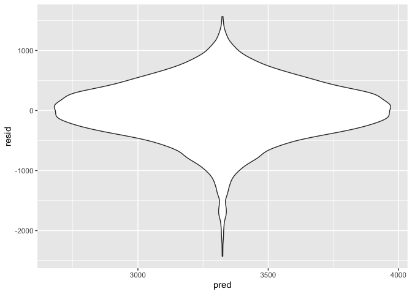
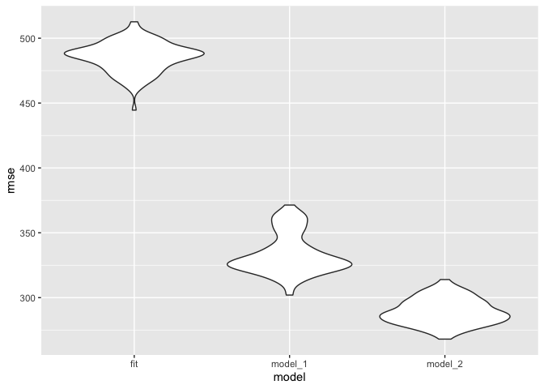

P8105\_HW6-yz4188
================
Yueran Zhang
12/02/2021

\#Problem 1

``` r
birthweight_df = read_csv("./birthweight.csv")
```

    ## Rows: 4342 Columns: 20

    ## ── Column specification ────────────────────────────────────────────────────────
    ## Delimiter: ","
    ## dbl (20): babysex, bhead, blength, bwt, delwt, fincome, frace, gaweeks, malf...

    ## 
    ## ℹ Use `spec()` to retrieve the full column specification for this data.
    ## ℹ Specify the column types or set `show_col_types = FALSE` to quiet this message.

``` r
#checking miss value
skimr::skim(birthweight_df)$n_missing 
```

    ##  [1] 0 0 0 0 0 0 0 0 0 0 0 0 0 0 0 0 0 0 0 0

There is no missing value in our dataframe.

``` r
## convert variables into factor
birthweight_df =
  birthweight_df %>%
    mutate(babysex = recode_factor(babysex, "1" = "male", "2" = "female")) %>% 
    mutate(frace = recode_factor(frace, "1" = "White", "2" = "Black", "3" = "Asian", "4" = "Puerto Rican", "8" = "Other", "9" = "Unknown")) %>% 
    mutate(malform = recode_factor(malform, "0" = "absent", "1" = "present")) %>% 
    mutate(mrace = recode_factor(mrace, "1" = "White", "2" = "Black", "3" = "Asian", "4" = "Puerto Rican", "8" = "Other")) 

birthweight_df
```

    ## # A tibble: 4,342 × 20
    ##    babysex bhead blength   bwt delwt fincome frace gaweeks malform menarche
    ##    <fct>   <dbl>   <dbl> <dbl> <dbl>   <dbl> <fct>   <dbl> <fct>      <dbl>
    ##  1 female     34      51  3629   177      35 White    39.9 absent        13
    ##  2 male       34      48  3062   156      65 Black    25.9 absent        14
    ##  3 female     36      50  3345   148      85 White    39.9 absent        12
    ##  4 male       34      52  3062   157      55 White    40   absent        14
    ##  5 female     34      52  3374   156       5 White    41.6 absent        13
    ##  6 male       33      52  3374   129      55 White    40.7 absent        12
    ##  7 female     33      46  2523   126      96 Black    40.3 absent        14
    ##  8 female     33      49  2778   140       5 White    37.4 absent        12
    ##  9 male       36      52  3515   146      85 White    40.3 absent        11
    ## 10 male       33      50  3459   169      75 Black    40.7 absent        12
    ## # … with 4,332 more rows, and 10 more variables: mheight <dbl>, momage <dbl>,
    ## #   mrace <fct>, parity <dbl>, pnumlbw <dbl>, pnumsga <dbl>, ppbmi <dbl>,
    ## #   ppwt <dbl>, smoken <dbl>, wtgain <dbl>

``` r
## propose a regression model for birthweight
fit = lm(bwt ~ wtgain * ppwt, data = birthweight_df)
  
fit %>% 
   broom::tidy() %>% 
   select(term, estimate, p.value) %>%
   knitr::kable(digits = 3)
```

| term        | estimate | p.value |
|:------------|---------:|--------:|
| (Intercept) | 2066.619 |   0.000 |
| wtgain      |   19.270 |   0.000 |
| ppwt        |    6.192 |   0.000 |
| wtgain:ppwt |   -0.053 |   0.029 |

``` r
birthweight_df %>% 
  modelr::add_predictions(fit) %>%
  modelr::add_residuals(fit) %>%
  ggplot(aes(x = pred,y = resid)) + geom_violin() 
```

<!-- -->

``` r
## compare with two other models
cv_df = 
  crossv_mc(birthweight_df, 100) %>% 
  mutate(
    fit = map(train, ~ lm(bwt~ wtgain * ppwt, data =.x )),
    model_1 = map(train, ~ lm(bwt ~ blength + gaweeks, data =.x )),
    model_2 = map(train, ~ lm(bwt ~ bhead * blength * babysex, data =.x ))) %>%
  
  mutate(
    rmse_fit = map2_dbl(fit, test, ~rmse(model = .x, data = .y)),
    rmse_model_1 = map2_dbl(model_1, test, ~rmse(model = .x, data = .y)),
    rmse_model_2 = map2_dbl(model_2, test, ~rmse(model = .x, data = .y)))

cv_plot =  cv_df %>% 
  select(starts_with("rmse")) %>% 
  pivot_longer(
    everything(),
    names_to = "model", 
    values_to = "rmse",
    names_prefix = "rmse_") %>% 
  mutate(model = fct_inorder(model)) %>% 
  ggplot(aes(x = model, y = rmse)) + geom_violin()

cv_plot
```

<!-- -->

From our plot, we can know that`model_2` is the best model to describe,
which used head circumference, length, sex and all interactions.
