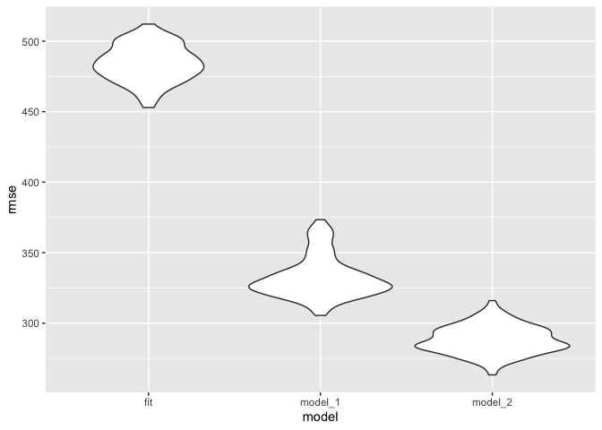
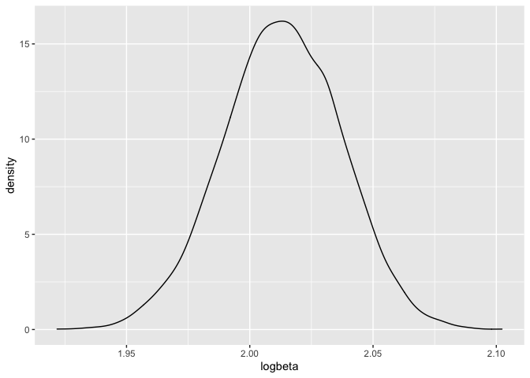

P8105\_HW6-yz4188
================
Yueran Zhang
12/02/2021

\#Problem 1

``` r
birthweight_df = read_csv("./birthweight.csv")
```

    ## Rows: 4342 Columns: 20

    ## ── Column specification ────────────────────────────────────────────────────────
    ## Delimiter: ","
    ## dbl (20): babysex, bhead, blength, bwt, delwt, fincome, frace, gaweeks, malf...

    ## 
    ## ℹ Use `spec()` to retrieve the full column specification for this data.
    ## ℹ Specify the column types or set `show_col_types = FALSE` to quiet this message.

``` r
## checking miss value
skimr::skim(birthweight_df)$n_missing 
```

    ##  [1] 0 0 0 0 0 0 0 0 0 0 0 0 0 0 0 0 0 0 0 0

There is no missing value in our dataframe.

``` r
## convert variables into factor
birthweight_df =
  birthweight_df %>%
    mutate(babysex = recode_factor(babysex, "1" = "male", "2" = "female")) %>% 
    mutate(frace = recode_factor(frace, "1" = "White", "2" = "Black", "3" = "Asian", "4" = "Puerto Rican", "8" = "Other", "9" = "Unknown")) %>% 
    mutate(malform = recode_factor(malform, "0" = "absent", "1" = "present")) %>% 
    mutate(mrace = recode_factor(mrace, "1" = "White", "2" = "Black", "3" = "Asian", "4" = "Puerto Rican", "8" = "Other")) 

birthweight_df
```

    ## # A tibble: 4,342 × 20
    ##    babysex bhead blength   bwt delwt fincome frace gaweeks malform menarche
    ##    <fct>   <dbl>   <dbl> <dbl> <dbl>   <dbl> <fct>   <dbl> <fct>      <dbl>
    ##  1 female     34      51  3629   177      35 White    39.9 absent        13
    ##  2 male       34      48  3062   156      65 Black    25.9 absent        14
    ##  3 female     36      50  3345   148      85 White    39.9 absent        12
    ##  4 male       34      52  3062   157      55 White    40   absent        14
    ##  5 female     34      52  3374   156       5 White    41.6 absent        13
    ##  6 male       33      52  3374   129      55 White    40.7 absent        12
    ##  7 female     33      46  2523   126      96 Black    40.3 absent        14
    ##  8 female     33      49  2778   140       5 White    37.4 absent        12
    ##  9 male       36      52  3515   146      85 White    40.3 absent        11
    ## 10 male       33      50  3459   169      75 Black    40.7 absent        12
    ## # … with 4,332 more rows, and 10 more variables: mheight <dbl>, momage <dbl>,
    ## #   mrace <fct>, parity <dbl>, pnumlbw <dbl>, pnumsga <dbl>, ppbmi <dbl>,
    ## #   ppwt <dbl>, smoken <dbl>, wtgain <dbl>

``` r
## propose a regression model for birthweight
fit = lm(bwt ~ wtgain * ppwt, data = birthweight_df)
  
fit %>% 
   broom::tidy() %>% 
   select(term, estimate, p.value) %>%
   knitr::kable(digits = 3)
```

| term        | estimate | p.value |
|:------------|---------:|--------:|
| (Intercept) | 2066.619 |   0.000 |
| wtgain      |   19.270 |   0.000 |
| ppwt        |    6.192 |   0.000 |
| wtgain:ppwt |   -0.053 |   0.029 |

``` r
birthweight_df %>% 
  modelr::add_predictions(fit) %>%
  modelr::add_residuals(fit) %>%
  ggplot(aes(x = pred,y = resid)) + geom_violin() 
```

<!-- -->

``` r
## compare with two other models
cv_df = 
  crossv_mc(birthweight_df, 100) %>% 
  mutate(
    fit = map(train, ~ lm(bwt~ wtgain * ppwt, data =.x )),
    model_1 = map(train, ~ lm(bwt ~ blength + gaweeks, data =.x )),
    model_2 = map(train, ~ lm(bwt ~ bhead * blength * babysex, data =.x ))) %>%
  
  mutate(
    rmse_fit = map2_dbl(fit, test, ~rmse(model = .x, data = .y)),
    rmse_model_1 = map2_dbl(model_1, test, ~rmse(model = .x, data = .y)),
    rmse_model_2 = map2_dbl(model_2, test, ~rmse(model = .x, data = .y)))

cv_plot =  cv_df %>% 
  select(starts_with("rmse")) %>% 
  pivot_longer(
    everything(),
    names_to = "model", 
    values_to = "rmse",
    names_prefix = "rmse_") %>% 
  mutate(model = fct_inorder(model)) %>% 
  ggplot(aes(x = model, y = rmse)) + geom_violin()

cv_plot
```

<!-- -->

From our plot, we can know that`model_2` is the best model to describe,
which used head circumference, length, sex and all interactions.

\#Problem 2

``` r
weather_df = 
  rnoaa::meteo_pull_monitors(
    c("USW00094728"),
    var = c("PRCP", "TMIN", "TMAX"), 
    date_min = "2017-01-01",
    date_max = "2017-12-31") %>%
  mutate(
    name = recode(id, USW00094728 = "CentralPark_NY"),
    tmin = tmin / 10,
    tmax = tmax / 10) %>%
  select(name, id, everything())
```

    ## Registered S3 method overwritten by 'hoardr':
    ##   method           from
    ##   print.cache_info httr

    ## using cached file: ~/Library/Caches/R/noaa_ghcnd/USW00094728.dly

    ## date created (size, mb): 2021-10-05 10:31:13 (7.602)

    ## file min/max dates: 1869-01-01 / 2021-10-31

``` r
## bootsample and check for it 
boot_sample = function(df) {
  sample_frac(df, replace = TRUE)
}

boot_sample(weather_df) %>% 
  ggplot(aes(x = tmin, y = tmax)) + 
  geom_point(alpha = .5) +
  stat_smooth(method = "lm")
```

    ## `geom_smooth()` using formula 'y ~ x'

<!-- -->

## Bootstrap

### R\_Square

``` r
R_square_results =
  R_square %>%
mutate(
    models = map(strap_sample, ~lm(tmax ~ tmin, data = .x) ),
    r_results = map(models, broom::glance)) %>% 
  select(-strap_sample, -models) %>% 
  unnest(r_results) 

R_square_results
```

    ## # A tibble: 5,000 × 13
    ##    strap_number r.squared adj.r.squared sigma statistic   p.value    df logLik
    ##           <int>     <dbl>         <dbl> <dbl>     <dbl>     <dbl> <dbl>  <dbl>
    ##  1            1     0.907         0.906  2.94     3524. 5.65e-189     1  -910.
    ##  2            2     0.896         0.896  3.13     3123. 2.12e-180     1  -933.
    ##  3            3     0.918         0.918  2.93     4056. 4.35e-199     1  -909.
    ##  4            4     0.899         0.898  3.13     3222. 1.37e-182     1  -933.
    ##  5            5     0.913         0.913  2.95     3831. 5.73e-195     1  -912.
    ##  6            6     0.919         0.918  2.90     4099. 7.62e-200     1  -906.
    ##  7            7     0.918         0.918  2.83     4084. 1.37e-199     1  -896.
    ##  8            8     0.907         0.907  2.96     3560. 1.06e-189     1  -914.
    ##  9            9     0.916         0.916  2.93     3969. 1.61e-197     1  -909.
    ## 10           10     0.918         0.917  2.82     4044. 7.09e-199     1  -895.
    ## # … with 4,990 more rows, and 5 more variables: AIC <dbl>, BIC <dbl>,
    ## #   deviance <dbl>, df.residual <int>, nobs <int>

``` r
R_square_results %>%
  ggplot(aes(x = r.squared)) +
  geom_density()
```

<!-- -->

``` r
R_square_results %>% 
  summarize(
    ci_lower = quantile(r.squared, 0.025), 
    ci_upper = quantile(r.squared, 0.975))
```

    ## # A tibble: 1 × 2
    ##   ci_lower ci_upper
    ##      <dbl>    <dbl>
    ## 1    0.894    0.927

For the R\_square is a left skewed distribution. The mean value is
0.9113306; the median value is 0.9117696; the standard deviation is
0.0085753; the lower of 95% CI is 0.8936684, the upper of 95% CI is
0.927106.

### log\_Beta

``` r
set.seed(1)

Beta_df = 
    tibble(
    strap_number = 1:5000,
    strap_sample = rerun(5000, boot_sample(weather_df))
  )
```

``` r
Beta_results =
  Beta_df %>%
mutate(
    models = map(strap_sample, ~lm(tmax ~ tmin, data = .x) ),
    beta_results = map(models, broom::tidy)) %>% 
  select(-strap_sample, -models) %>% 
  unnest(beta_results) 

Beta_results
```

    ## # A tibble: 10,000 × 6
    ##    strap_number term        estimate std.error statistic   p.value
    ##           <int> <chr>          <dbl>     <dbl>     <dbl>     <dbl>
    ##  1            1 (Intercept)    7.45     0.223       33.5 5.02e-113
    ##  2            1 tmin           1.03     0.0174      59.4 5.65e-189
    ##  3            2 (Intercept)    7.36     0.243       30.3 1.98e-101
    ##  4            2 tmin           1.03     0.0185      55.9 2.12e-180
    ##  5            3 (Intercept)    7.48     0.215       34.8 8.29e-118
    ##  6            3 tmin           1.04     0.0163      63.7 4.35e-199
    ##  7            4 (Intercept)    7.91     0.234       33.7 6.50e-114
    ##  8            4 tmin           0.998    0.0176      56.8 1.37e-182
    ##  9            5 (Intercept)    6.73     0.243       27.7 1.69e- 91
    ## 10            5 tmin           1.07     0.0173      61.9 5.73e-195
    ## # … with 9,990 more rows

``` r
log_beta = 
  Beta_results %>%
  select(strap_number, term, estimate) %>%
  pivot_wider(names_from = term,values_from = estimate) %>%
  mutate(logbeta = log(`(Intercept)`*tmin))
```

``` r
log_beta %>%
  ggplot(aes(x = logbeta)) +
  geom_density()
```

<!-- -->

For the log\_beta is a normal distribution. The mean value is 2.0131027;
the median value is 2.0132666; the standard deviation is 0.0239315; the
lower of 95% CI is 1.9649487, the upper of 95% CI is 2.0588875.
